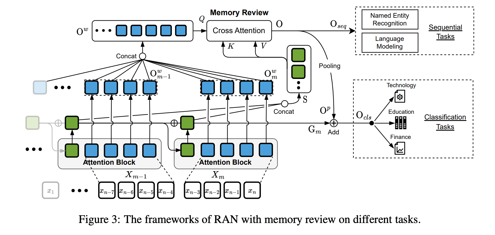

<h1 align='center'>RAN: Recurrent Attention Network</h1>

<h4 align='center'> 📢 This project is still in the works in order to make long document modeling easier.</h4>

<h4 align="center">
   <a href="https://github.com/4AI/RAN/blob/main/LICENSE">
      
   </a>
   <a href="https://pypi.org/project/rannet/">
      
   </a>
   <a href="https://pypi.org/project/rannet/">
      
   </a>
   <a href="http://makeapullrequest.com">
      
   </a>
   <a href="https://arxiv.org/abs/2306.06843">
      
   </a>
</h4>


<p align="center">

</p>


# ⬇️ Installation

*stable*

```bash
python -m pip install -U rannet
```

*latest*

```bash
python -m pip install git+https://github.com/4AI/RAN.git
```

*environment*
- ⭐ tensorflow>2.0,<=2.10 🤗 `export TF_KERAS=1`
- tensorflow>=1.14,<2.0 🤗 Keras==2.3.1

## 🏛️ Pretrained Models

### V3 Models

🎯 compatible with: `rannet>0.2.1`

| Lang | Google Drive | Baidu NetDrive |
|------|--------------|----------------|
| EN   |    [base](https://drive.google.com/file/d/1CO1M_57U506_3mDBqtGo-5b1XXNpONln/view?usp=sharing)          |        [base](https://pan.baidu.com/s/1Z2wODILsIeZ3i8_9GEpl2g)\[code: udts\]        |

Chinese Models are still pretraining...


### V2 Models

🎯 compatible with: `rannet<=0.2.1`

| Lang | Google Drive | Baidu NetDrive |
|------|--------------|----------------|
| EN   |    [base](https://drive.google.com/file/d/1mRabw0Hy9T5_EWbZshD6Uk-bvauNzG9R/view?usp=sharing)          |        [base](https://pan.baidu.com/s/18uhAkY46aIcy4ncwzXp5mA)\[code: djkj\]        |
| CN   |   [base](https://drive.google.com/file/d/1_gmrulSU-ln_jElc2hktPTTQDzaeG1wU/view?usp=sharing)  \| [small](https://drive.google.com/file/d/1D-FCxY_UMwZCkvcwl6hkRcl6VnCzRGIj/view?usp=sharing)         |        [base](https://pan.baidu.com/s/1WIcePgmqb7Ox0w1qigWQ_w)\[code: e47w\]  \| [small](https://pan.baidu.com/s/17DAboL9w0mArcBBuiy3tGg)\[code: mdmg\]        |

### V1 Models

V1 models are not open.


# 🚀 Quick Tour

## 🈶 w/ pretrained models

*Extract semantic feature*

set `return_sequences=False` to extract semantic feature.

```python
import numpy as np
from rannet import RanNet, RanNetWordPieceTokenizer


vocab_path = 'pretrained/vocab.txt'
ckpt_path = 'pretrained/model.ckpt'
config_path = 'pretrained/config.json'
tokenizer = RanNetWordPieceTokenizer(vocab_path, lowercase=True)

rannet, rannet_model = RanNet.load_rannet(
    config_path=config_path,
    checkpoint_path=ckpt_path,
    return_sequences=False,
    apply_cell_transform=False,
    cell_pooling='mean'
)
text = 'input text'
tok = tokenizer.encode(text)
vec = rannet_model.predict(np.array([tok.ids]))
```

*For the classification task*

```python
from rannet import RanNet, RanNetWordPieceTokenizer


vocab_path = 'pretrained/vocab.txt'
ckpt_path = 'pretrained/model.ckpt'
config_path = 'pretrained/config.json'
tokenizer = RanNetWordPieceTokenizer(vocab_path, lowercase=True)

rannet, rannet_model = RanNet.load_rannet(
    config_path=config_path, checkpoint_path=ckpt_path, return_sequences=False)
output = rannet_model.output  # (B, D)
output = L.Dropout(0.1)(output)
output = L.Dense(2, activation='softmax')(output)
model = keras.models.Model(rannet_model.input, output)
model.summary()
```

*For the sequence task*

```python
from rannet import RanNet, RanNetWordPieceTokenizer


vocab_path = 'pretrained/vocab.txt'
ckpt_path = 'pretrained/model.ckpt'
config_path = 'pretrained/config.json'
tokenizer = RanNetWordPieceTokenizer(vocab_path, lowercase=True)

rannet, rannet_model = RanNet.load_rannet(
    config_path=config_path, checkpoint_path=ckpt_path, return_cell=False)
output = rannet_model.output  # (B, L, D)
rannet_model.summary()
```

## 🈚 w/o pretrained models

Embed the `RAN` (a Keras layer) into your network.

```python
from rannet import RAN

ran = RAN(head_num=8,
          head_size=256,
          window_size=256,
          min_window_size=16,
          activation='swish',
          kernel_initializer='glorot_normal',
          apply_lm_mask=False,
          apply_seq2seq_mask=False,
          apply_memory_review=True,
          dropout_rate=0.0,
          cell_initializer_type='zero')
output, cell = ran(X)
```

## w/ history

```python
import numpy as np
from rannet import RanNet, RanNetWordPieceTokenizer


vocab_path = 'pretrained/vocab.txt'
ckpt_path = 'pretrained/model.ckpt'
config_path = 'pretrained/config.json'
tokenizer = RanNetWordPieceTokenizer(vocab_path, lowercase=True)

rannet, rannet_model = RanNet.load_rannet(
    config_path=config_path,
    checkpoint_path=ckpt_path,
    return_sequences=False,
    apply_cell_transform=False,
    return_history=True,  # return history
    cell_pooling='mean',
    with_cell=True,  # with cell input
)
rannet_model.summary()

text = 'sentence 1'
tok = tokenizer.encode(text)
init_cell = np.zeros((1, 768))  # 768 is embedding size
vec, history = rannet_model.predict([np.array([tok.ids]), init_cell])

text2 = 'sentence 2'
tok = tokenizer.encode(text2)
vec2, history = rannet_model.predict([np.array([tok.ids]), history])  # input history of sentence 1
```

# 📚 Citation

If you use our code in your research, please cite our work:

```
@inproceedings{li-etal-2023-recurrent,
    title = "Recurrent Attention Networks for Long-text Modeling",
    author = "Li, Xianming  and
      Li, Zongxi  and
      Luo, Xiaotian  and
      Xie, Haoran  and
      Lee, Xing  and
      Zhao, Yingbin  and
      Wang, Fu Lee  and
      Li, Qing",
    booktitle = "Findings of the Association for Computational Linguistics: ACL 2023",
    month = jul,
    year = "2023",
    publisher = "Association for Computational Linguistics",
    pages = "3006--3019",
}
```

# 📬 Contact

Please contact us at 1) for code problems, create a GitHub issue; 2) for paper problems, email xmlee97@gmail.com
